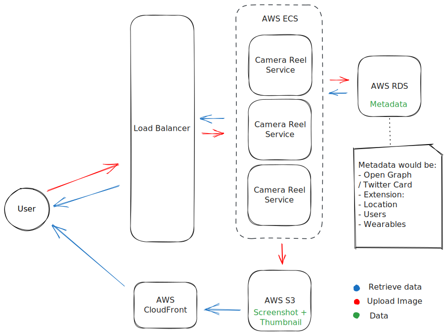

<p align="center">
  <a href="https://decentraland.org">
    
  </a>
</p>
<h1 align="center">
  Camera Reel Service
</h1>

The Camera Reel Service is a simple solution designed specifically for uploading and retrieving camera images taken from Decentraland Explorer. This service enables users to capture and store images with additional metadata, providing valuable context to enhance their visual content.

# Setup

Before start, make sure you have these installed:

- **Rust** | you can use this [Development setup guide](https://www.notion.so/decentraland/Development-Setup-3ea6715744944d1cbab0bf569f329f06)
- **docker-compose** | used for DB and MinIO (local S3)
- **just** (optional) | A command runner - use `cargo install just` or follow the [Installation guide](https://github.com/casey/just#installation)

# Run

Before running the Camera Reel service you need Postgres and MinIO (local S3) instances, you can start both by running:

```console
$ just run-services

or

$ docker-compose -f docker-compose.dev.yml up -d
```

In order to run the Camera Reel service:

```console
$ cargo run
```

Also, you can run it in watch mode by installing `cargo-watch` and using the command to run the server:

```console
$ cargo install cargo-watch
$ cargo watch -x 'run'
```

In order to run the tests:

```console
$ cargo test
```

## Logging

The `RUST_LOG` environment variable can be used to specify the log level, for example:

```console
$ RUST_LOG=debug cargo run
```

_See [these docs](https://docs.rs/env_logger/latest/env_logger/) to understand the possible values._

## API Docs

The [`utoipa` crate](https://github.com/juhaku/utoipa) is used to generate the OpenAPI Documentation and a UI.

- `{server}/api/docs/ui`: Swagger UI with endpoints and schemas
- `{server}/api/docs/openapi.json`: OpenAPI json used by the UI

## Authentication

Some endpoints may be authenticated based on the environment. The authentication method is the Signed Fetch and follows the [ADR-44](https://adr.decentraland.org/adr/ADR-44).

Those endpoints are:

- POST `{server}/api/images/`
- DELETE `{server}/api/images/{image_id}`
- GET `{server}/api/users/{address}` (if non authenticated, it will take into account public images)
- GET `{server}/api/users/{address}/images` (if non authenticated, it will only return public images)
- PATCH `{server}/api/images/{image_id}/visibility`
- GET `{server}/api/places/{place_id}/images`
- POST `{server}/api/places/images`

There is an [upload example](examples/upload-image.rs), you can run it:

```console
$ cargo run --example upload-image
```

# Database Migrations

To manage database migrations follow SQLX CLI instructions ([link](https://github.com/launchbadge/sqlx/blob/main/sqlx-cli/README.md))

# Architecture

Here is a highlevel architecture overview that can help to understand the project strucuture and components:



## AI Agent Context

For detailed AI Agent context, see [docs/ai-agent-context.md](docs/ai-agent-context.md).