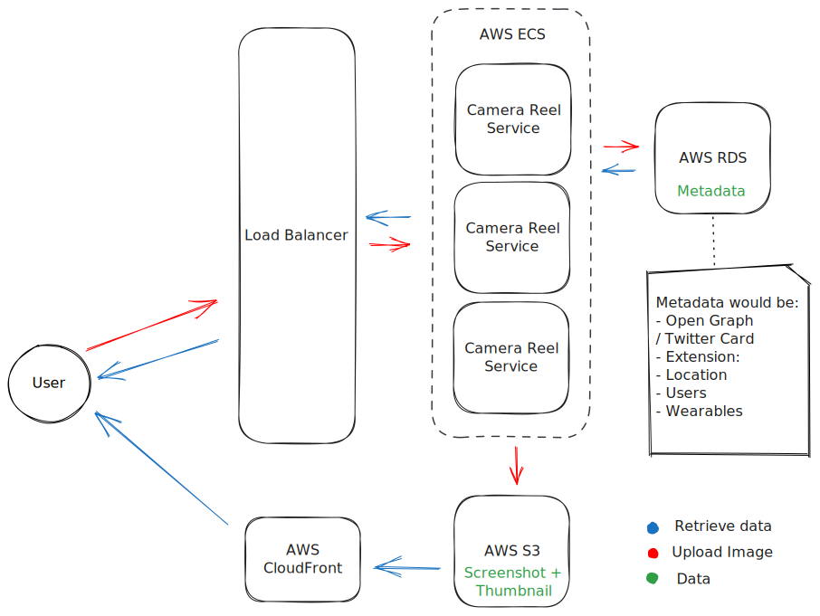

# Camera Reel Service

[](https://coveralls.io/github/decentraland/camera-reel-service?branch=main)

The Camera Reel Service is a solution designed specifically for uploading and retrieving camera images taken from Decentraland Explorer. This service enables users to capture and store images with additional metadata, providing valuable context to enhance their visual content.

This server interacts with PostgreSQL for image metadata storage, AWS S3 or MinIO for image file storage, and AWS SNS for event notifications in order to provide users with the ability to upload, manage, and share screenshots from their Decentraland experiences.

## Table of Contents

- [Features](#features)
- [Dependencies](#dependencies)
- [API Documentation](#api-documentation)
- [Database](#database)
  - [Schema](#schema)
  - [Migrations](#migrations)
- [Getting Started](#getting-started)
  - [Prerequisites](#prerequisites)
  - [Installation](#installation)
  - [Configuration](#configuration)
  - [Running the Service](#running-the-service)
- [Testing](#testing)

## Features

- **Image Upload**: Upload and store camera images captured from Decentraland Explorer with metadata (coordinates, scene, timestamp, visibility)
- **Visibility Management**: Control image visibility settings (public/private) per user
- **Place Associations**: Associate images with places (parcels/scenes) for discovery
- **User Galleries**: Provide user galleries and place-based image collections
- **Image Management**: Support image deletion and metadata updates
- **OpenAPI Documentation**: Auto-generated API documentation via utoipa crate

## Dependencies

- **[Decentraland Explorer](https://github.com/decentraland/explorer)**: Client application that captures and uploads images
- **PostgreSQL**: Database for image metadata, user associations, and place mappings
- **AWS S3 or MinIO**: Object storage for actual image file storage
- **AWS SNS**: Event notifications for image uploads and updates

## API Documentation

The API is fully documented using the [OpenAPI standard](https://swagger.io/specification/). The interactive documentation is available at:

- `{server}/api/docs/ui`: Swagger UI with endpoints and schemas
- `{server}/api/docs/openapi.json`: OpenAPI JSON specification

### Authentication

Some endpoints require authentication based on the environment. The authentication method is Signed Fetch and follows the [ADR-44](https://adr.decentraland.org/adr/ADR-44) specification.

Authenticated endpoints:

- POST `{server}/api/images/` - Upload image
- DELETE `{server}/api/images/{image_id}` - Delete image
- GET `{server}/api/users/{address}` - Get user data (if non-authenticated, only public images)
- GET `{server}/api/users/{address}/images` - Get user images (if non-authenticated, only public images)
- PATCH `{server}/api/images/{image_id}/visibility` - Update image visibility
- GET `{server}/api/places/{place_id}/images` - Get place images
- POST `{server}/api/places/images` - Get multiple places images

There is an [upload example](examples/upload-image.rs) that demonstrates how to upload images:

```bash
cargo run --example upload-image
```

## Database

### Schema

See [docs/database-schemas.md](docs/database-schemas.md) for detailed schema, column definitions, and relationships.

### Migrations

The service uses SQLX CLI for database migrations. These migrations are located in `migrations/`.

To manage database migrations, follow SQLX CLI instructions: [SQLX CLI Documentation](https://github.com/launchbadge/sqlx/blob/main/sqlx-cli/README.md)

#### Create a new migration

```bash
sqlx migrate add name-of-the-migration
```

#### Manually applying migrations

To run migrations:

```bash
sqlx migrate run
```

To rollback migrations:

```bash
sqlx migrate revert
```

## Getting Started

### Prerequisites

Before running this service, ensure you have the following installed:

- **Rust**: Latest stable version (edition 2021)
  - You can use this [Development setup guide](https://www.notion.so/decentraland/Development-Setup-3ea6715744944d1cbab0bf569f329f06)
- **Cargo**: Rust package manager (included with Rust)
- **Docker**: For containerized deployment and local development dependencies
- **just** (optional): A command runner for convenience
  - Install with: `cargo install just` or follow the [Installation guide](https://github.com/casey/just#installation)

### Installation

1. Clone the repository:

```bash
git clone https://github.com/decentraland/camera-reel-service.git
cd camera-reel-service
```

2. Build the project:

```bash
cargo build
```

### Configuration

The service uses environment variables for configuration. Copy the example file and adjust as needed:

```bash
cp .env.example .env
```

See `.env.example` for available configuration options.

### Running the Service

#### Setting up the environment

In order to successfully run this server, external dependencies such as databases and storage must be provided.

To do so, this repository provides you with a `docker-compose.dev.yml` file for that purpose. In order to get the environment set up, run:

```bash
docker-compose -f docker-compose.dev.yml up -d
```

Or using just (if installed):

```bash
just run-services
```

This will start:

- PostgreSQL database on port `5432`
- MinIO (local S3) on port `9000` (API) and `9001` (Console)

#### Running in development mode

To run the service in development mode:

```bash
cargo run
```

To run with watch mode (auto-reload on changes), install `cargo-watch` first:

```bash
cargo install cargo-watch
cargo watch -x 'run'
```

#### Logging

The `RUST_LOG` environment variable can be used to specify the log level:

```bash
RUST_LOG=debug cargo run
```

See [env_logger documentation](https://docs.rs/env_logger/latest/env_logger/) for possible values.

## Testing

This service includes comprehensive test coverage.

### Running Tests

Run all tests:

```bash
cargo test
```

Run tests with output:

```bash
cargo test -- --nocapture
```

### Test Structure

- **Unit Tests**: Test individual components and functions in isolation
- **Integration Tests**: Test the complete request/response cycle

For detailed testing guidelines and standards, refer to our [Testing Standards](https://github.com/decentraland/docs/tree/main/development-standards/testing-standards) documentation.

## Architecture

Here is a high-level architecture overview that can help to understand the project structure and components:



## AI Agent Context

For detailed AI Agent context, see [docs/ai-agent-context.md](docs/ai-agent-context.md).

---

**Note**: Remember to configure your environment variables before running the service. The service requires PostgreSQL and S3-compatible storage (AWS S3 or MinIO) to function properly.
