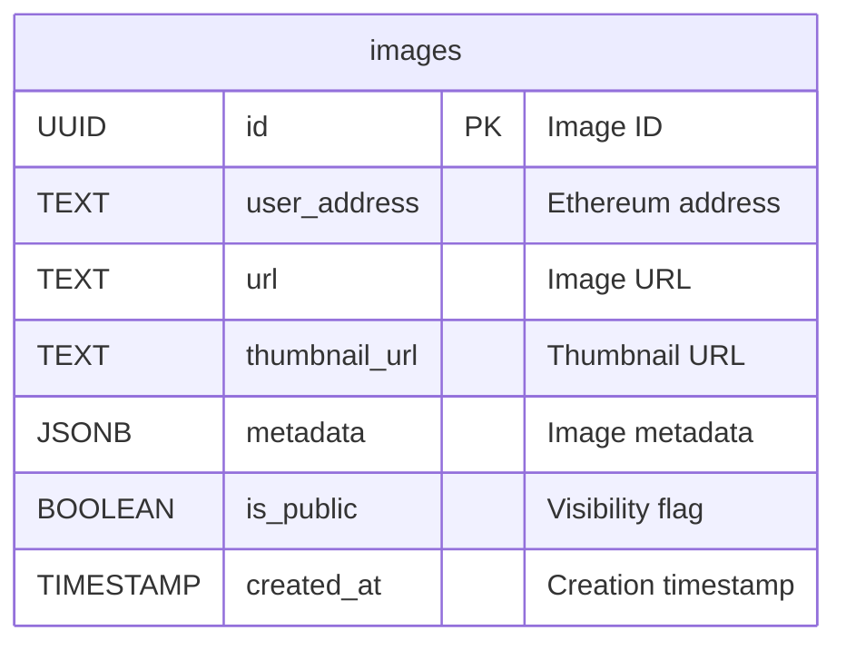

# Database Schema Documentation

This document describes the database schema for the Camera Reel Service. The schema uses PostgreSQL and is managed through migrations located in `migrations/`.

## Database Schema Diagram



## Tables Overview

The database contains one main table:

1. **`images`** - Stores image metadata, URLs, and user associations

## Table: `images`

Stores all camera images captured from Decentraland Explorer, including their metadata, storage URLs, visibility settings, and user associations.

### Columns

| Column | Type | Nullable | Description |
|--------|------|----------|-------------|
| `id` | UUID | NOT NULL | **Primary Key**. Unique image identifier. Auto-generated. |
| `user_address` | TEXT | NOT NULL | Ethereum address of the user who uploaded the image. |
| `url` | TEXT | NOT NULL | Full URL to the image file stored in S3/MinIO. |
| `thumbnail_url` | TEXT | NOT NULL | URL to the thumbnail version of the image. Defaults to empty string. |
| `metadata` | JSONB | NOT NULL | Image metadata stored as JSON. Contains coordinates, scene information, place ID, timestamp, etc. |
| `is_public` | BOOLEAN | NOT NULL | Visibility flag. `true` for public images, `false` for private images. Defaults to `false`. |
| `created_at` | TIMESTAMP | NOT NULL | Timestamp when the image was created. Defaults to `now()`. |

### Indexes

- **Primary Key**: `id`
- **Index**: `images_user_address_idx` on `user_address` column - For efficient user image queries
- **Index**: `idx_user_address_is_public` on `(user_address, is_public)` - For filtering user images by visibility
- **Index**: `images_place_id_idx` on `(metadata->>'placeId')` - For place-based image queries
- **Index**: `idx_place_id_is_public_created_at_desc` on `((metadata->>'placeId'), is_public, created_at DESC)` - Composite index for place-based queries with visibility and sorting

### Constraints

- **Primary Key**: `id` must be unique
- **NOT NULL**: All columns except those explicitly nullable are required

### Business Rules

1. **Visibility Control**: Images marked as `is_public = false` are only visible to the owner (user_address). Public images can be discovered via place associations.
2. **Metadata Structure**: The `metadata` JSONB column typically contains:
   ```json
   {
     "coordinates": { "x": 0, "y": 0, "z": 0 },
     "scene": "scene-id",
     "placeId": "place-id",
     "timestamp": "2024-01-01T00:00:00Z"
   }
   ```
3. **Place Association**: Images can be associated with places via the `placeId` field in metadata, enabling place-based discovery.
4. **Thumbnail Generation**: Thumbnail URLs are generated and stored separately from full image URLs for performance optimization.
5. **User Address Format**: User addresses are stored as TEXT (Ethereum addresses in their original format).

### Other

- **JSONB Metadata**: The `metadata` column uses PostgreSQL's JSONB type for flexible schema and efficient querying
- **Timestamp Default**: The `created_at` column defaults to the current timestamp on insert
- **Index on JSONB**: The `placeId` index uses a JSONB path expression `(metadata->>'placeId')` for efficient place-based queries

## Related Code

- **Migrations**: `migrations/`
- **Database Logic**: `src/database.rs`
- **API Handlers**: `src/api/`

